<div align="center">
  
# 👋 Hi, I'm Ojaswi Bhardwaj

[](https://git.io/typing-svg)

[](https://ojaswi-portfolio-kappa.vercel.app/)
[](https://www.linkedin.com/in/ojaswi-bhardwaj-962393281/)
[](mailto:ojaswideep2020@gmail.com)

</div>

---

### 🚀 About Me

```typescript
const ojaswi = {
    role: "Full-Stack Engineer",
    specialization: ["Real-Time Systems", "Mobile & Web Development", "Backend APIs"],
    code: ["TypeScript", "JavaScript", "Python", "Java", "Dart"],
    technologies: {
        frontend: ["React", "Next.js", "Flutter"],
        backend: ["Node.js", "Django", "Express", "Socket.IO"],
        databases: ["Supabase", "MongoDB", "MySQL", "PostgreSQL"],
        cloud: ["GCP", "Firebase", "Vercel"]
    },
    achievements: {
        leetcode: "200+ Problems Solved",
        latency: "<200ms Real-Time Apps",
        focus: "Performance & Scalability"
    }
};
```

---


<div align="center">
  
</div>


---

## 🚀 Featured Projects

<div align="center">

<table>
<tr>
<td width="50%" valign="top">

### 🔥 [ConnectUs](https://github.com/ojaswi1234/connectus)
**Real-Time Chat Platform**


**Highlights:**
- ⚡ Sub-200ms latency optimization
- 🔐 End-to-end encryption
- 📱 Offline-first architecture
- 🎯 95% reduction in server load

**Impact:** Seamless real-time communication for thousands of users

</td>
<td width="50%" valign="top">

### 📊 [DevOps Dashboard](https://github.com/ojaswi1234/devops-dashboard)
**Server Health & CI/CD Monitor**


**Highlights:**
- 📡 Real-time server metrics tracking
- 🚀 Automated deployment pipelines
- 🔔 Instant alerting system
- 📈 CPU, memory & network monitoring

**Impact:** 70% faster deployment cycles with zero-downtime releases

</td>
</tr>
</table>

</div>
---

### 📈 Contribution Activity

<div align="center">


</div>

---

### 🎯 What I'm Up To

```yaml
Currently:
  - 🔨 Building: Scalable WebSocket infrastructure
  - 📚 Learning: Microservices, Redis, Docker/K8s
  - 🌱 Exploring: GraphQL, Serverless, Edge Computing
  
Focus Areas:
  - Performance optimization
  - Real-time systems architecture
  - Cross-platform mobile development
```

---

### 🏅 Certifications

- 🥇 **Competitive Programming** - SkillStone (Grazitti Interactive)
- 🥇 **ChatGPT Prompt Engineering** - DeepLearning.AI
- 🥇 **GitHub Fundamentals** - GitHub
- 🥇 **Python & Java** - HackerRank

---

<div align="center">

*"Building performant applications that scale"* ⚡

</div>
