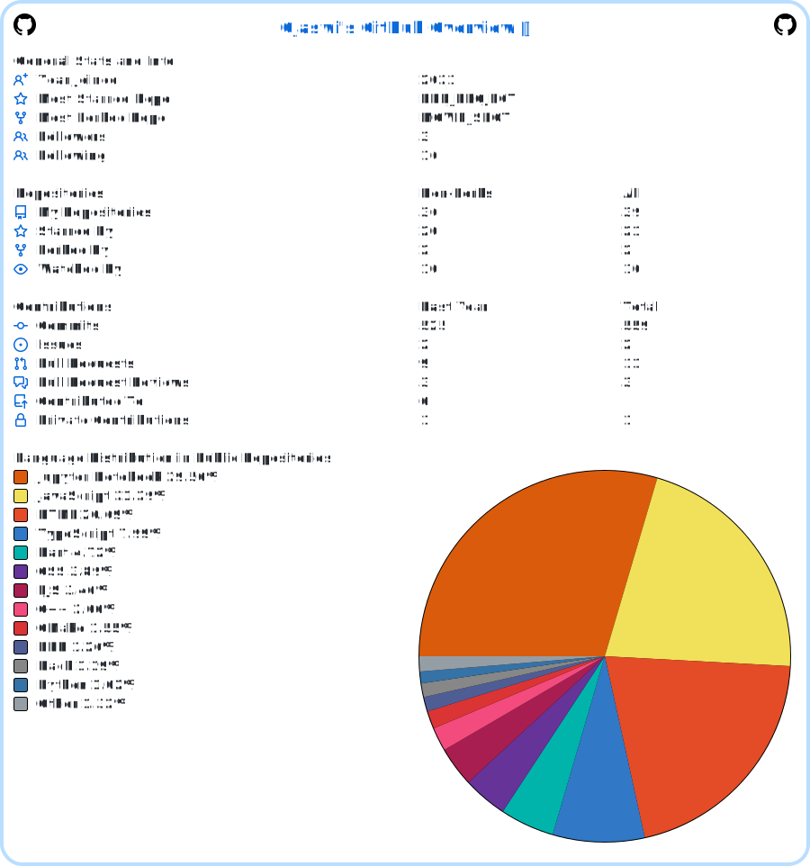

<div align="center">
  
# 👋 Hi, I'm Ojaswi Bhardwaj

[](https://git.io/typing-svg)

[](https://ojaswi-portfolio-kappa.vercel.app/)
[](https://www.linkedin.com/in/ojaswi-bhardwaj-962393281/)
[](mailto:ojaswideep2020@gmail.com)

</div>

---

### 🚀 About Me

```typescript
const ojaswi = {
    role: "Full-Stack Engineer",
    specialization: ["Real-Time Systems", "Mobile Development", "Backend APIs"],
    code: ["TypeScript", "JavaScript", "Python", "Java", "Dart"],
    technologies: {
        frontend: ["React", "Next.js", "Flutter"],
        backend: ["Node.js", "Django", "Express", "Socket.IO"],
        databases: ["Supabase", "MongoDB", "MySQL", "PostgreSQL"],
        cloud: ["GCP", "Firebase", "Vercel"]
    },
    achievements: {
        leetcode: "200+ Problems Solved",
        latency: "<200ms Real-Time Apps",
        focus: "Performance & Scalability"
    }
};
```

---

### 🛠️ Tech Stack

<div align="center">


</div>

---

<div align="center">
  
</div>


---

### 🏆 Featured Projects

<table>
<tr>
<td width="50%">

#### 🔥 [ConnectUs](https://github.com/ojaswi1234/connectus)
**Real-Time Chat Platform**

`Flutter` `Supabase` `WebSockets`

- ⚡ **<200ms latency** with optimized connections
- 🔐 E2E encryption & offline-first architecture  
- 📊 **95% server load** reduction via caching

</td>
<td width="50%">

#### ♟️ [Two-Player Chess](https://github.com/ojaswi1234/two-player-chess)
**Multiplayer Game Engine**

`Node.js` `Socket.IO` `Express`

- 🎮 **Zero invalid moves** server-side validation
- ⚡ **<50ms response** time per move
- 🏅 ELO matchmaking system

</td>
</tr>
</table>

---

### 📈 Contribution Activity

<div align="center">


</div>

---

### 🎯 What I'm Up To

```yaml
Currently:
  - 🔨 Building: Scalable WebSocket infrastructure
  - 📚 Learning: Microservices, Redis, Docker/K8s
  - 🌱 Exploring: GraphQL, Serverless, Edge Computing
  
Focus Areas:
  - Performance optimization
  - Real-time systems architecture
  - Cross-platform mobile development
```

---

### 🏅 Certifications

- 🥇 **Competitive Programming** - SkillStone (Grazitti Interactive)
- 🥇 **ChatGPT Prompt Engineering** - DeepLearning.AI
- 🥇 **GitHub Fundamentals** - GitHub
- 🥇 **Python & Java** - HackerRank

---

<div align="center">

*"Building performant applications that scale"* ⚡

</div>
